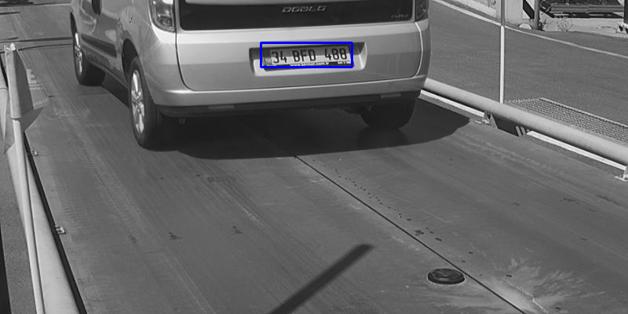
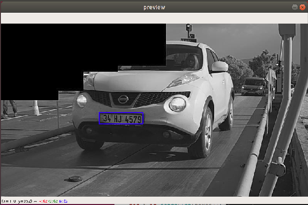
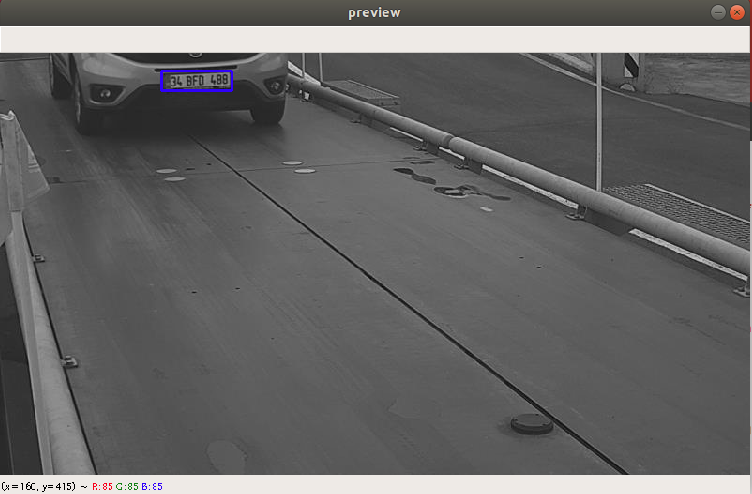
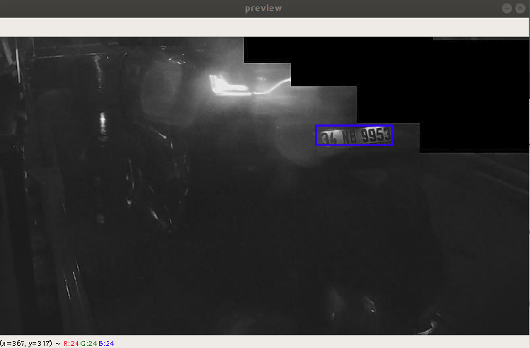
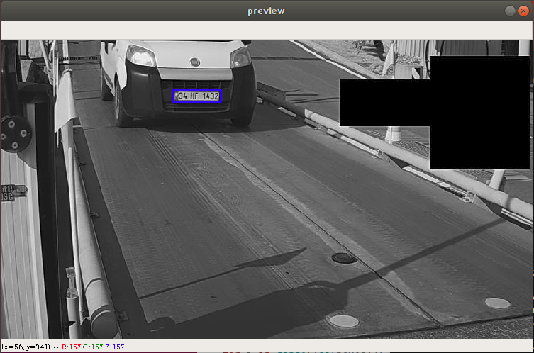

# License-Plate-Recognition

This model trained on 800x450 gray images. If you want the succesfully result you should use images have same specs.

## Usage 
First of all, You should fix the path adresses due to your computer!
### For detecting plate 

```
Python3 detect.py
```
### For extracting characters from plates
```
Python3 extract_char.py
```














